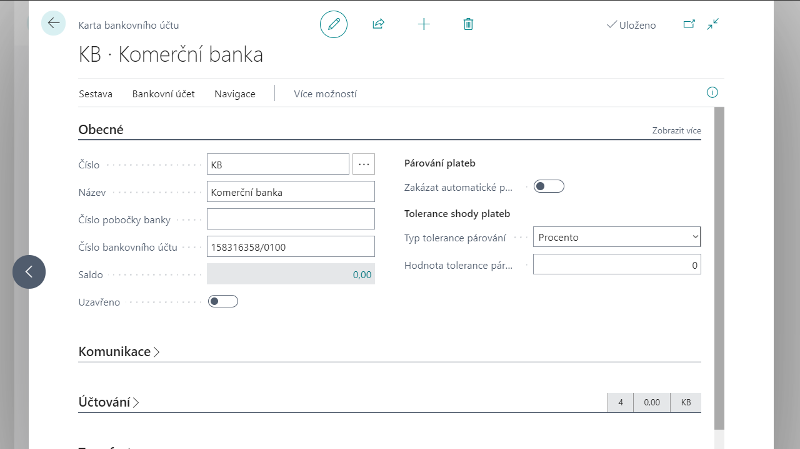
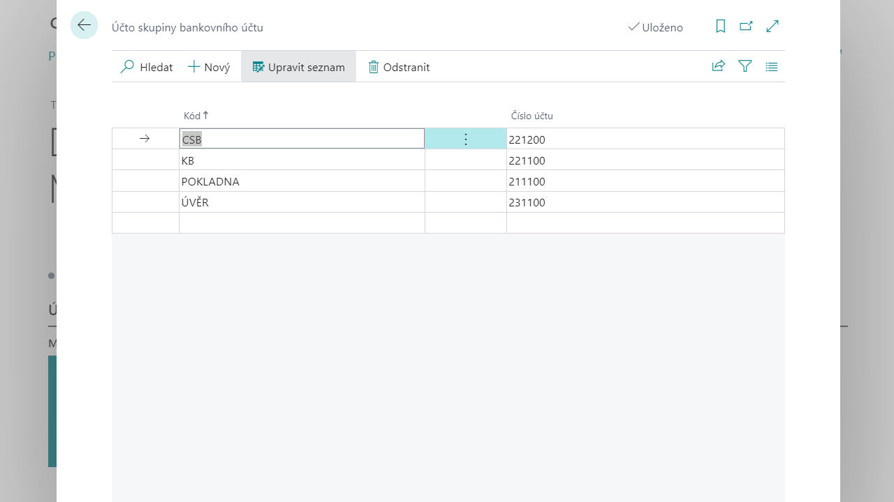
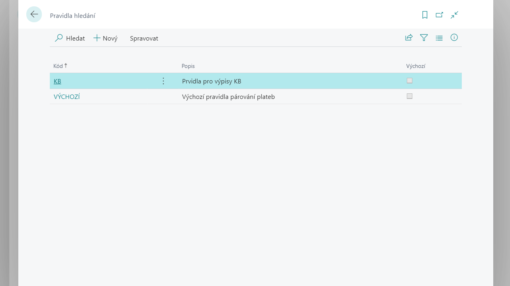
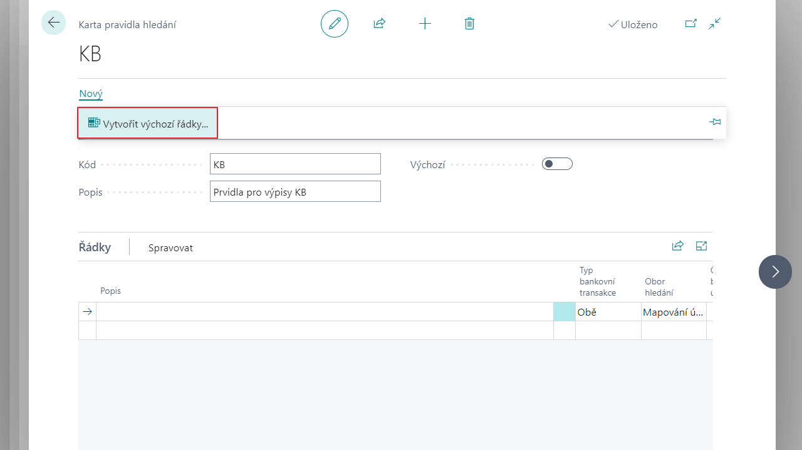
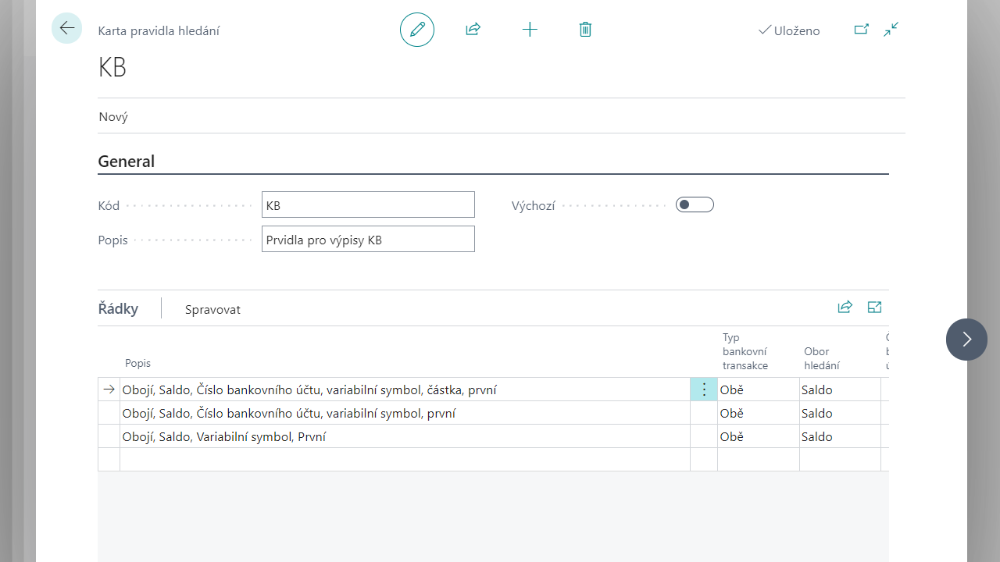

# Nastavení bankovní aplikace

Aby bylo možno zpracovávat bankovní výpisy a platební příkazy, je potřeba nejprve provést nastavení bankovních účtů, nastavení pravidel pro automatické zpracování návrhů vyrovnání plateb a nastavení komunikace s bankovními rozhraními daných bankovních ústavů. 

## Nastavení bankovního účtu
Bankovní účty společnosti zobrazíte vyhledáním stránky **Bankovní účty**. Údaje o bankovním účtu se spravují na **kartě bankovního účtu**.

1. Vyberte ikonu , zadejte **Bankovní účty** a poté vyberte související odkaz.
2. V přehledu bankovních účtů vyberte bankovní účet, který chcete nastavit.
3. Na kartě bankovního účtu nastavte **následující části**:
    - **Záložka obecné**:  
        Povinné pole **Číslo** (jednoznačná identifikace vytvářené karty bankovního účtu) lze, dle nastavení, zadat ručně nebo nechat přiřadit číslo automaticky z číselné řady. Dále je zde možné zadat **Název** bankovního účtu, a především **Číslo bankovního účtu.**

        Prostřednictvím polí **Typ tolerance párování** a **Hodnota tolerance párování** lze nastavit povolenou odchylku plateb dle procent či částky. Zde zadanou odchylku použije funkce automatického vyrovnání plateb pro pravidlo hledání shody dle částky k dohledání možných položek k vyrovnání.

        Je zde zobrazeno aktuální **Saldo** bankovního účtu. Pole **Saldo (LM)** pak znázorňuje zůstatek bankovního účtu přepočtený dle platného kurzu konkrétního dokladu do lokální (účetní) měny. Položky bankovního účtu, ze kterých je tvořeno aktuální zaúčtované saldo, lze zobrazit rozkliknutím částek v těchto polích.
        Bankovní účet lze uzavřít pro používání aktivováním pole **Uzavřeno**.
        

    - **Záložka Komunikace**:  
        Záložka Komunikace obsahuje adresní a kontaktní informace banky jako je **Adresa, PSČ/město, Kód země a Telefonní číslo**. Dále je možné zadat kontaktní osobu v bance v poli **Kontakt**.

    - **Záložka Účtování**:  
        Na záložce je pole **Kód měny**, ve které bude evidováno saldo bankovního účtu, zobrazené na záložce Obecné. Pozn. prázdná hodnota v poli Kód měny znamená, že je bankovní účet veden v lokální měně.  
        Dále je zde důležité pole **Účto skupina bankovního účtu**. Na finanční účet nastavený v této účto skupině budou účtovány všechny pohyby daného bankovního účtu. Viz. níže kapitola Nastavení účto skupin bankovního účtu.

    - **Záložka Transfer**:  
        Na záložce Transfer se vyplňují pole pro elektronickou komunikaci. Do pole **Kód SWIFT** je možné vyplnit mezinárodní bankovní kód identifikátoru banky, u níž je veden daný účet. Pole **IBAN** obsahuje mezinárodní číslo bankovního účtu. Formát čísla je při zadání kontrolován, zda odpovídá platné mezinárodní standardizované formě čísla účtu (IBAN).

        Dále se zde vyplňují pole **Formát importu bankovního výpisu**, **Formát exportu plateb** a **Formát exportu zahraničních plateb**, které odkazují do Nastavení exportu/importu banky, na základě něhož probíhá export a import souborů, viz níže kapitola Nastavení exportu/importu banky.

    - **Záložka Deník plateb**:  
        Zde se nachází pole týkající se nastavení automatického vyrovnání položek bankovního výpisu při překlopení do deníku plateb.  
        Aktivováním polí **Variabilní s. do popisu**, **Variabilní s. do variabilního symbolu** a **Variabilní s. do externího čísla dokladu** je určeno, do kterých polí se má propisovat variabilní symbol z řádku vydaného bankovního výpisu. Pokud je aktivováno pole **Dimenze z párované položky**, jsou do řádků deníku vyplňovány dimenze z položek, se kterými jsou platby vyrovnány. Pokud je aktivováno pole **Účtovat po řádcích**, je do každého vytvořeného řádku deníku vložen i protiúčet (bankovní účet). V opačném případě je deník vyrovnán jedním řádkem se souhrnnou částkou pro záporné položky a jednou pro kladné.

        Do pole **Účet nepřiřazených plateb** musí být vyplněn finanční účet, který bude použit ve funkci automatického párování bankovního výpisu v případě, že nebude možné přiřadit platbu ke konkrétní položce.

    - **Záložka Platební příkazy**:  
        Do polí **Tuzemský platební příkaz** a **Zahraniční platební příkaz** se vyplňuje číslo tiskové sestavy, která bude použita pro tisk tuzemského/zahraničního platebního příkazu.

        V poli **Kód základního kalendáře** lze bankovnímu účtu přiřadit konkrétní nadefinovaný kalendář. Kalendář specifikuje pracovní a nepracovní dny. Definici kalendáře můžete použít ve funkci pro návrh řádků platebního příkazu, tak aby systém nenavrhoval datum splatnosti platebního příkazu na nepracovní dny. 
        Do polí **Výchozí konstantní symbol** a **Výchozí specifický symbol** se vyplňují hodnoty, které budou použity jako výchozí v řádcích platebního příkazu. Do pole **Popis řádku platebního příkazu** se vyplňuje výchozí popis řádku platebního příkazu při použití funkce **Navrhni platby**. Pokud je aktivováno pole **Částečný návrh** plateb, budou navrhovány i položky, které již byly částečně uhrazeny (částečně navrženy k úhradě).

        Aktivací pole **Zahraniční platební příkazy** určujete, že při vytváření platebního příkazu bude hodnota pole Zahraniční bankovní příkaz nastavena také na Ano (nastavení je důležité při exportu platebních příkazů).
        Pokud je aktivováno pole **Kontrolovat český formát účtu při vydání**, tak se kontroluje při vydání dokladu platebního příkazu, zda formát zadaného čísla bankovního účtu v řádcích příkazu odpovídá obvyklému formátu, jaký se používá v ČR. 
   
    - **Záložka Bankovní výpisy**:  
        V polích **Název šablony deníku plateb** a **Název listu deníku plateb** je nutné zadat, do které šablony a listu deníku plateb budou převedeny položky bankovního výpisu pro zaúčtování.

        Aktivací pole **Kontrola ext. čísla v aktuálním roce** definujete, že systém bude při vydání bankovního výpisu kontrolovat, zda se mezi vydanými bankovními výpisy již nenachází výpis se stejným číslem externího dokladu v rámci daného kalendářního roku. Pozn.: do pole Číslo externího dokladu v dokladu bankovního výpisu se zadává číslo výpisu přiřazené bankou.

    - **Záložka Číslování**:
        Zde se nachází pole pro zadání číselných řad souvisejících s bankou. Pro nastavení způsobu číslování je nutné zadat kódy číselných řad do polí **Čísla příkazů**, **Čísla vydaných příkazů,** **Čísla výpisů** a **Čísla vydaných výpisů**.
4. Po nastavení můžete kartu bankovního účtu zavřít.
## Nastavení exportu a importu banky
V nastavení exportu/importu banky se nastavují reporty, codeunity, xml porty apod. sloužící pro importy a exporty platebních příkazů a bankovních výpisů.

1. Vyberte ikonu , zadejte **Nastavení exportu/importu banky** a poté vyberte související odkaz.
2. Vyberte datový formát, který chcete nastavit a nastavte následující pole:
     - V poli **Kód** je uveden identifikační kód daného řádku, který se následně vyplňuje na kartě bankovního účtu, pro určení, který import a export má být pro daný bankovní účet použit.
     - V poli **Název** se uvádí popis daného řádku.
     - V poli **Směr** se vybírá směr souboru v systému Business Central, jedná se o Import, Export nebo Export-pozitivní platba.
     - V polích **ID procedury zpracování** a **Název procedury zpracování** jsou uvedeny codeunity pro import či export.
     - V polích **XML portu zpracování** a Název **XML portu zpracování** jsou uvedeny xml porty pro import a export.
     - V polích **ID sestavy zpracování** a **Název sestavy zpracování** jsou uvedeny reporty pro import a export.
     - V poli **Výchozí typ souboru** lze uvádět výchozí typ souboru, ve kterém bude soubor importován/exportován.
3. Po nastavení můžete přehled zavřít.
## Nastavení konstantních symbolů
V číselníku **Konstantní symboly** se zakládají veškeré používané konstantní symboly při bankovním styku.  

Pro definování tohoto číselníku postupujte následujícím způsobem:
1. Vyberte ikonu , zadejte **Konstantní symboly** a poté vyberte související odkaz.
2. V číselníku konstatních symbolů vyplňte do řádku **Kód** konstatního symbolu a jeho **Popis**.
3. Po vyplnění všech konstatních symbolů můžete přehled zavřít.

## Nastavení účto skupin bankovního účtu

Pro definování tohoto číselníku postupujte následujícím způsobem:
1. Vyberte ikonu , zadejte **Účto skupiny bankovního účtu** a poté vyberte související odkaz.
2. V číselníku Účto skupiny bankovního účtu vyplňte do řádku **Kód** pro jednoznačnou identifikaci dané účto skupiny a **Číslo účtu** z účetní osnovy, na které budou účtovány pohyby na bankovním účtu v této účto skupině.
3. Po vyplnění všech účto skupin bankovních účtů můžete přehled zavřít.

## Nastavení pravidel pro párování bankovních výpisů

Pravidla hledání slouží pro automatické vyrovnávání položek bankovního výpisu při vytvoření deníku plateb z daného bankovního výpisu. Mohou podstatně zrychlit práci při zpracování bankovního výpisu v systému a usnadnit uživatelům identifikaci jednotlivých plateb.

Vlastní pravidla vyrovnání plateb nastavíte v číselníku **Pravidla hledání**. Souběžně může být v číselníku nastaveno několik různých pravidel. Můžete nastavit vlastní pravidla pro bankovní účty nebo například pro různé typy bankovních výpisů.

### Definice pravidla hledání
Pravidla hledání slouží pro automatické vyrovnávání položek bankovního výpisu při vytvoření deníku plateb z daného bankovního výpisu. Mohou podstatně zrychlit práci při zpracování bankovního výpisu v systému a usnadnit uživatelům identifikaci jednotlivých plateb.

Vlastní pravidla vyrovnání plateb nastavíte v číselníku **Pravidla hledání**. Souběžně může být v číselníku nastaveno několik různých pravidel. Můžete nastavit vlastní pravidla pro bankovní účty nebo například pro různé typy bankovních výpisů.

Pro definici **Pravidel hledání** postupujte následujícím způsobem:
1. Vyberte ikonu , zadejte **Pravidla hledání** a poté vyberte související odkaz.
2. Na přehledu kliněte na funkci **Nový**, následně se Vám otevře karta pravidla hledání.
3. Do pole **Kód** zadáte jednoznačnou identifikaci pravidla a do pole **Popis** můžete popsat dané pravidlo hledání. Aktivací pole **Výchozí** můžete jedno z pravidel označit jako výchozí. V poli je kontrola, že v rámci záznamů v tabulce může být označen jako výchozí (hodnota Ano) pouze jeden záznam. **Výchozí pravidlo** systém doplní do bankovních výpisů v případě, že na daném bankovním účtu nebude definováno jiné pravidlo hledání.
4. Každé pravidlo by mělo obsahovat alespoň jeden řádek. Na **pořadí řádků pravidel** záleží, mělo by se postupovat od největší shody k obecnějším pravidlům. Pořadí řádků tedy určuje prioritu, s jakou se systém pokusí dané pravidlo aplikovat. Upravit pořadí řádků lze pomocí tlačítek nad řádky. **Posunout nahoru a Posunout dolů** umožní změnit pořadí řádků pro vyhledávání.

Řádky pravidla je možné vytvořit ručně dle potřeby uživatelů nebo je možné vygenerovat předdefinovaná pravidla pomocí funkce **Vytvořit výchozí řádky**.

**Jeden řádek vyhledávacího pravidla má tři logické celky**:

- **Identifikační**
- **Vyhledávací** (hledání v položkách zákazníka, dodavatele, zaměstnance, „starých“ zálohách Base aplikace). Pozn.: aplikace nových CZ záloh (Advance Payments Localization for Czech) ještě doplňuje hledání v „nových“ nákupních a prodejních zálohách
- **Filtrovací** (na základě nastavené masky se přímo určí, jak navrhnout řádek do deníku plateb)
Na jednom řádku může být buď definice vyhledávání nebo definice filtrování. Nelze je v rámci jednoho řádku kombinovat.

**Identifikační část pravidla**
- **Popis** – může obsahovat detailní popis pravidla pro lepší orientaci.
- **Typ bankovní transakce** – zde je možné definovat omezení na typ bankovní transakce. Hodnoty mohou být Kredit, Debet nebo Obě (bez rozlišení – výchozí hodnota). Pokud bude mít pravidlo např. nastaveno Debet, tak tento řádek bude aplikován pouze na řádky v bankovním výpise, které mají kladnou částku.
- **Obor hledání určuje**, která logická část řádku je platná. Možné volby budou:
    - **Saldo** – vyhledávání v položkách zákazníka, dodavatele, zaměstnance, „starých“ zálohách Base aplikace
    - **Zákazník** – vyhledávání v položkách zákazníka a „starých“ prodejních zálohách Base aplikace
    - **Dodavatel** – vyhledávání v položkách dodavatele a „starých“ nákupních zálohách Base aplikace
    - **Zaměstnanec** – vyhledávání v položkách zaměstnance 
    - **Zálohy** – volbu doplňuje aplikace nových CZ záloh (Advance Payments Localization for Czech) a umožňuje vyhledání v „nových“ nákupních a prodejních zálohách
    - **Mapování účtů** - tato volba určí, že nebude použita vyhledávací část pravidla, ale část filtrovací.

**Vyhledávací část pravidla**

Určuje pravidla pro vyhledávání položky k vyrovnání v určeném rozsahu (v položkách zákazníka, dodavatele, zaměstnance a zálohách).  
Pole v této části je možné parametrizovat pouze tehdy, pokud na daném řádku vyhledávacího pravidla je v poli **Obor hledání** hodnota jiná než **Mapování účtů**.  
Pozn.: pokud bude vyhledávací část pravidla obsahovat více voleb současně, tak mezi jednotlivými volbami bude vždy vztah konjunkce (tj. a současně).

 - **Číslo bankovního účtu** – pokud bude pole zatrženo, tak systém bude v daném rozsahu (položka zákazníka, dodavatele, zaměstnance) hledat podle čísla bankovního účtu. Vždy se pro daný řádek bankovního výpisu vyhledává v bankovních účtech zákazníka / dodavatele a bankovní účet v tabulce zaměstnanec. Pokud je nalezen právě jeden účet zákazníka či dodavatele či zaměstnance, automaticky se k daným filtrům navíc nasazuje filtr na číslo zákazníka / dodavatele / zaměstnance v položkách.  
- **Částka** – v případě, že pole bude zatrženo, tak systém bude vyhledávat podle částky s kódem měny v daném rozsahu (položka zákazníka, dodavatele, zaměstnance, zálohy). Systém bude pracovat s tolerancí shody plateb definovanou na kartě daného bankovního účtu (pole Typ tolerance párování a Hodnota tolerance párování).  
- **Variabilní symbol** – pokud bude pole aktivováno, tak systém bude v daném rozsahu (položka zákazníka, dodavatele, zaměstnance, zálohy) hledat podle variabilního symbolu.  
- **Konstantní symbol** – analogicky jako u pole Variabilní symbol.  
- **Specifický symbol** – analogicky jako u pole Variabilní symbol.  
- **Vícenásobný výsledek** – pole určí, jakou položku má systém navrhnout k vyrovnání v případě, že zadaným kritériím vyhledávacího pravidla vyhovuje více než jedna položka. Možné hodnoty pole jsou:
    - **První vytvořená položka** - Systém vybere nejstarší položku
    - **Naposledy vytvořená položka** - Systém vybere nejnovější položku
    - **Nejbližší datum splatnosti** - Systém vybere tu z položek, která má nejstarší datum splatnosti. Při shodě hodnot data splatnosti z nich vybere první položku
    - **Poslední datum splatnost**i - Systém vybere tu z položek, která má nejmladší datum splatnosti. Při shodě hodnot data splatnosti z nich vybere první položku
    - **Nejbližší zúčtovací datum** - Systém vybere tu z položek, která má nejstarší zúčtovací datum. Při shodě hodnot data z nich vybere první položku
    - **Poslední zúčtovací datum** - Systém vybere tu z položek, která má nejmladší zúčtovací datum. Při shodě hodnot data z nich vybere první položku
    - **Nejmenší zbývající částka** - Systém vybere tu z položek, která má nejmenší hodnotu v poli Zůstatek (LM). Při shodě hodnot částky zůstatku z nich vybere první položku
    - **Největší zbývající částka** - Systém vybere tu z položek, která má největší hodnotu v poli Zůstatek (LM). Při shodě hodnot částky zůstatku z nich vybere první položku
    - **Pokračovat** - Při této volbě systém nevybere žádnou položku a v rámci párování pokračuje dalším vyhledávacím pravidlem

**Filtrační část pravidla**

Určuje pravidla (specifikaci filtrů) pro vyhledání účtu, který se má použít k zaúčtování řádku bankovního výpisu.
Pole v této části bude možné parametrizovat pouze pokud na daném řádku vyhledávacího pravidla bude v poli **Obor hledání hodnota = Mapování účtů**. Tzn. systém nebude hledat položku k vyrovnání na saldech.
Pozn.: pokud se ve filtrační části nastavení použije více voleb najednou, tak mezi jednotlivými volbami je vždy konjunkce (tj. a současně).
- **Filtr popisu** – do pole je možné zapsat filtr popisu transakce řádku z bankovního výpisu. Je možné použít standardní řídící znaky používané v systému Business Central. Např.: při zadání filtru @*poplatek* se bude testovat, zda popis transakce obsahuje slovo poplatek bez ohledu na velikost písmen a diakritiku na libovolné pozici v textu.
- **Filtr variabilního symbolu** – funguje obdobně, jako Filtr popisu, ale nad polem Variabilní symbol v řádku bankovního výpisu. Např. pokud bude zadáno ??32*, pak se testuje, zda variabilní symbol má libovolné dvě číslice na prvních dvou pozicích, na třetí pozici číslici 3 a čtvrté číslici 2, na zbývajících pozicích mohou být libovolné číslice. Pokud bude zadáno 308|0308 - testuje se, zda symbol nabývá hodnoty 308 nebo 0308.
- **Filtr konstantního symbolu** – platí totéž jako pro pole Filtr variabilního symbolu.
- **Filtr specifického symbolu** – platí totéž jako pro pole Filtr variabilního symbolu. 
- Pokud systém v řádku bankovního výpisu na základě zadaných filtrů najde shodu, pak se do řádku finančního deníku zapíše typ účtu a číslo účtu, které jsou uvedeny v polích **Typ účtu**, **Číslo účtu**.

### Pravidla při vyhledávání a párování
- Jakmile je nalezen řádek bankovního výpisu, který odpovídá vyhledávacímu pravidlu nebo nastavenému filtru, tj. je nalezena právě jedna položka, automaticky zastavuje vyhodnocování a pokračuje se dalším řádkem na bankovním výpisu.
- Pokud systém podle definovaných vyhledávacích pravidel nenalezne žádný záznam, který by vyhovoval, pak přiřadí řádku výpisu účet neidentifikované platby, který je definován pro daný bankovní účet na kartě bankovního účtu v poli **Účet nepřiřazených plateb**.
- Pokud se řádek vyhledávacího pravidla vyhodnotí jako pozitivní, bude jeho identifikace propsána do řádku deníku plateb do polí **Kód pravidla hledání** a **Kód řádku pravidla hledání**.

## Viz také
[Bankovní doklady pro Česko (rozšíření)](ui-extensions-banking-documents-localization-cz.md)  
[České lokální funkcionality](czech-local-functionality.md)  
[Finance](../../finance.md)
