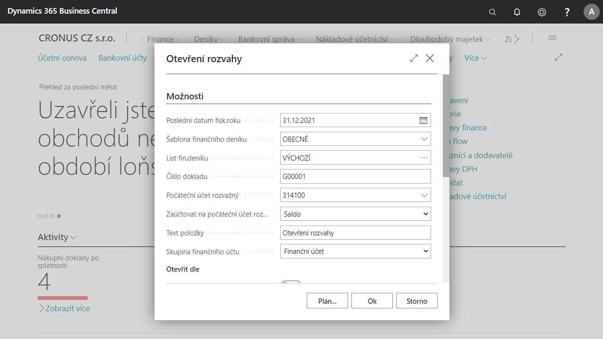

# Uzávěrkové operace

V souladu s účetními předpisy (zákon o účetnictví č. 563/1991 § 17) musí být na konci fiskálního roku provedeny následující účetní operace:
- Uzavření účtů zisků a ztrát (Uzavření výsledovky)
- Uzavření rozvahových účtů (nová rozvaha Uzavření rozvahy)
- Otevření rozvahových účtů (nová rozvaha Otevření rozvahy)

## Tato funkce obsahuje následující změny

- Uzavření výsledovky – standardní sestava uzavření výsledovky byla vylepšena.
- Uzavření rozvahy – byla přidána sestava Uzavření rozvahy. Tato sestava je tvořena řádky ve finančním deníku. Tyto řádky obsahují uzávěrková účtování vůči Konečnému účtu rozvažnému.
- Otevření rozvahy – byla přidána sestava Otevření rozvahy. Tato sestava je tvořena řádky ve finančním deníku. Tyto řádky obsahují uzávěrková účtování vůči Počátečnímu účtu rozvažnému.  

## Uzavření období
1. Vyberte ikonu , zadejte **Účetní období** a poté vyberte související odkaz.
2. Vyberte řádek s rokem, který chcete uzavřít a použijte funkci **Uzavřít rok**.
3. Zavřete přehled účetních období. 
## Uzavření výsledovky
1. Vyberte ikonu , zadejte **Uzavření výsledovky** a poté vyberte související odkaz.
2. Na stránce **Uzavření výsledovky** je nutné nastavit několik polí, aby proběhlo uzavření výsledovky správně.
3. Pole **Poslední datum fisk. roku** se automaticky vyplní posledním datem posledního uzavřeného fiskálního roku.  
4. Je nutné vyplnit pole **Šablona finančního deníku** a **List finančního deníku**, pro navržení řádků s uzavíranými účty.
5. Do pole **Číslo dokladu** zadejte číslo, se kterým budou uzávěrkové operace zaúčtovány.
6. Dále do pole **Účet dosažených zisků** zadejte účet, kterým budou uzavřeny řádky s uzavíranými účty.
7. Do pole **Text položky** zadejte text pro výchozí text pro popis řádků.
8. V sekci **Uzavřít dle** můžete kliknout na AssistEdit (tři tečky) vedle pole **Dimenze**, kde můžete vybrat dimenze, podle kterých má uzavření proběhnout.
9. Sekci **Skupina finančního účtu** nevyplňujte, nechte prázdnou.
10. Sestavu spusťte pomocí tlačítka OK.
11. Vyberte ikonu , zadejte **Finanční deníky** a poté vyberte související odkaz.
12. Otevřete vybraný **finanční deník a jeho list** nastavený v předešlém kroku.
13. Deník je nyní vyplněn řádky se zadaným číslem dokladu, datem, popisem nastaveným v předešlém kroku. Dále, uzavření dle dimenzí – pro každý účet vznikne tolik řádků v deníku, kolik je kombinací dimenzí na daném účtu. V řádcích finančního deníku jsou pouze finanční účty, které mají nastaveno pole Skupina finančního účtu = prázdné.

## Uzavření rozvahy
1. Vyberte ikonu , zadejte **Uzavření rozvahy** a poté vyberte související odkaz.
2. Na stránce **Uzavření rozvahy** je nutné nastavit několik polí, aby proběhlo uzavření rozvahy správně.
3. Pole **Poslední datum fisk. roku** se automaticky vyplní posledním datem posledního uzavřeného fiskálního roku.  
4. Je nutné vyplnit pole **Šablona finančního deníku** a **List finančního deníku**, pro navržení řádků s uzavíranými účty.
5. Do pole **Číslo dokladu** zadejte číslo, se kterým budou uzávěrkové operace zaúčtovány.
6. Dále do pole **Konečný účet rozvažný** zadejte účet, kterým budou uzavřeny řádky s uzavíranými účty.
7. Do pole **Text položky** zadejte text pro výchozí text pro popis řádků.
8. V sekci **Uzavřít dle** můžete kliknout na AssisEdit (tři tečky) vedle pole **Dimenze**, kde můžete vybrat dimenze, podle kterých má uzavření proběhnout.
9. Sekci **Skupina finančního účtu** nevyplňujte, nechte prázdnou.
10. Sestavu spusťte pomocí tlačítka OK.
11. Vyberte ikonu , zadejte **Finanční deníky** a poté vyberte související odkaz.
12. Otevřete vybraný **finanční deník a jeho list** nastavený v předešlém kroku.
13. Deník je nyní vyplněn řádky se zadaným číslem dokladu, datem, popisem nastaveným v předešlém kroku. Dále, uzavření dle dimenzí – pro každý účet vznikne tolik řádků v deníku, kolik je kombinací dimenzí na daném účtu. V řádcích finančního deníku jsou pouze finanční účty, které mají nastaveno pole Skupina finančního účtu = prázdné. 

## Otevření rozvahy
1. Vyberte ikonu , zadejte **Otevření rozvahy** a poté vyberte související odkaz.
2. Na stránce **Otevření rozvahy** je nutné nastavit několik polí, aby proběhlo otevření rozvahy dobře.
3. Pole **Poslední datum fisk. roku** se automaticky vyplní posledním datem posledního uzavřeného fiskálního roku.  
4. Je nutné vyplnit pole **Šablona finančního deníku** a **List finančního deníku**, pro navržení řádků s uzavíranými účty. 
5. Do pole **Číslo dokladu** zadejte číslo, se kterým budou uzávěrkové operace zaúčtovány.
6. V poli **Počáteční účet rozvažný** vyberte účet.
7. V poli **Text položky** zadejte text pro výchozí text pro popis řádků.
8. Pole **Otevřít dle** klepněte na tlačítko AssistEdit (tři tečky) vedle pole **Dimenze** a vyberte dimenze, podle kterých má otevření proběhnout.
9. Sekci **Skupina finančního účtu** nevyplňujte, nechte prázdnou.
10. Sestavu spusťte pomocí tlačítka OK.

## Viz také  

[Základní lokalizační balíček pro Česko](ui-extensions-core-localization-pack-cz.md)  
[Česká lokální funkcionalita](czech-local-functionality.md)  
[Finance](finance.md)  
